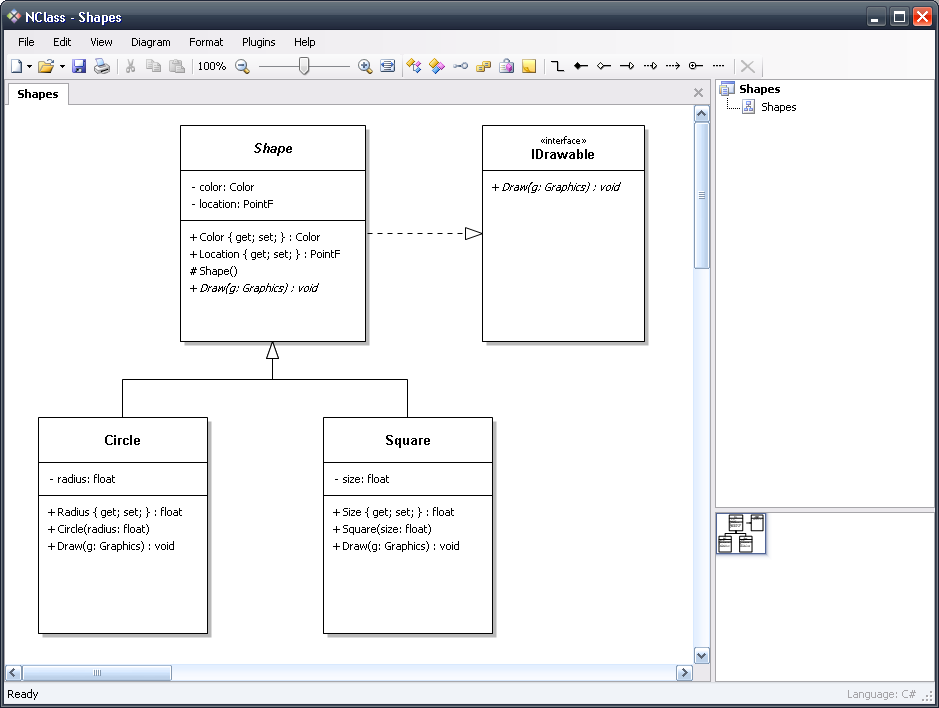
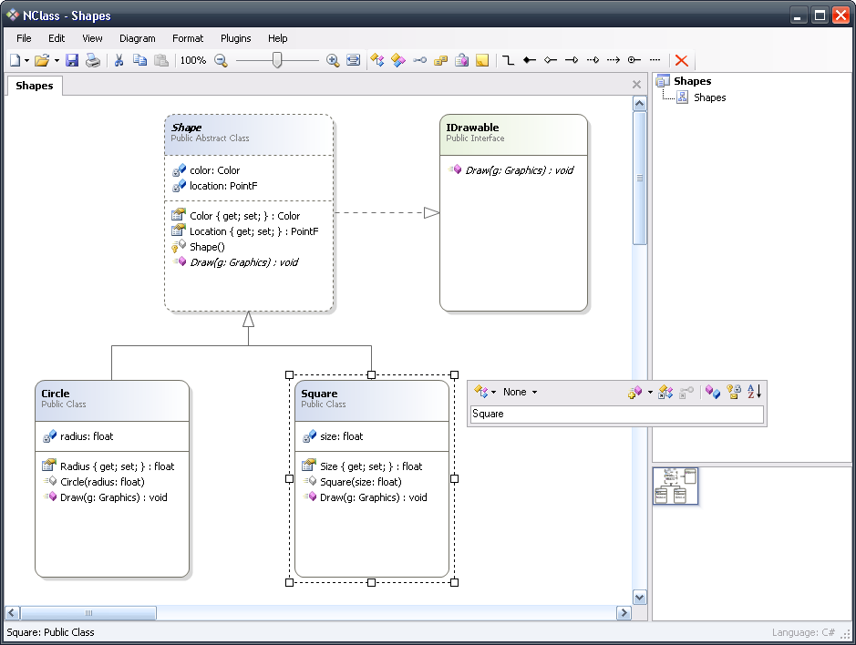
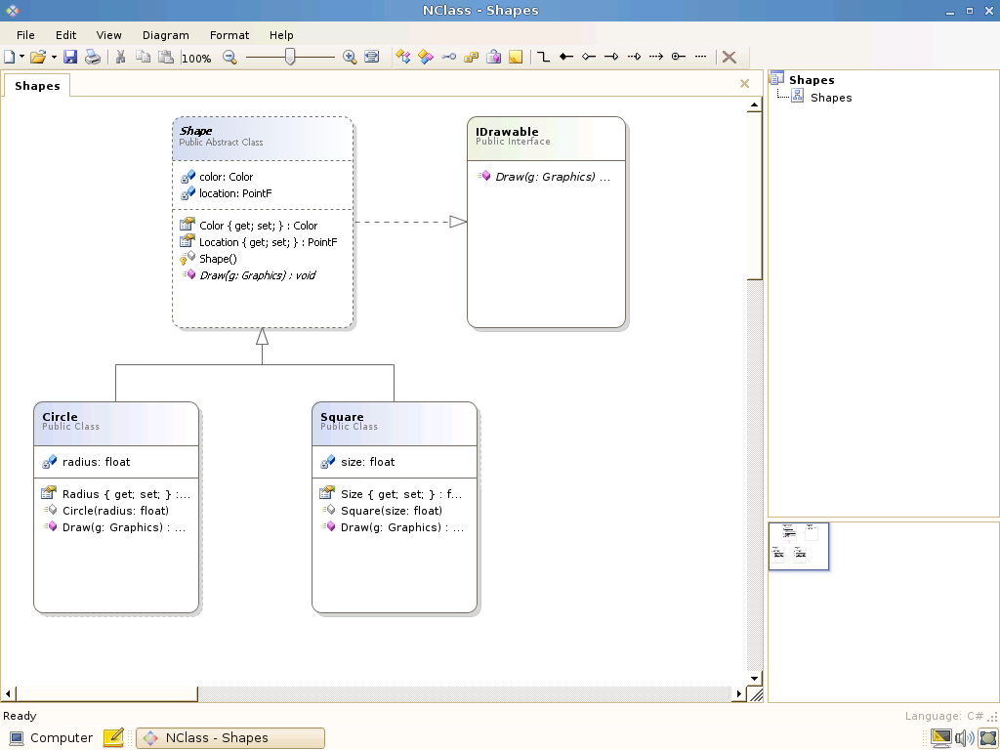
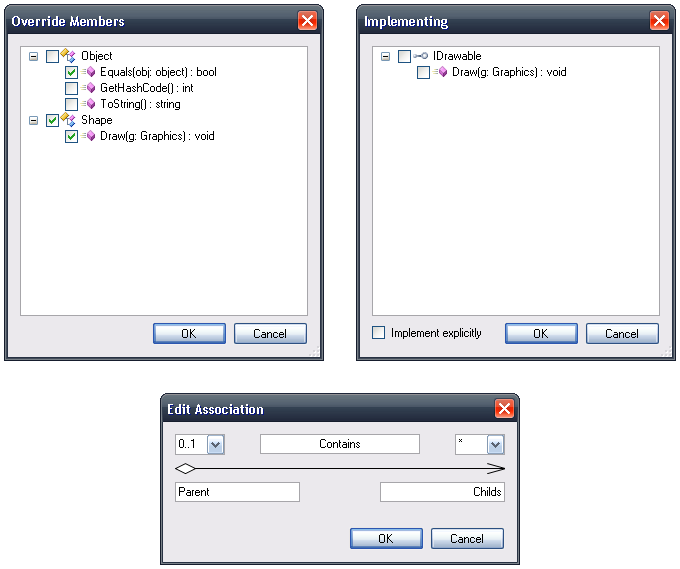
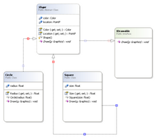
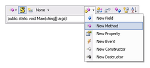

# nERD
formerly NClass (http://nclass.sourceforge.net/)

## Overview
NClass is a free tool to easily create UML class diagrams with full C# and Java language support. The user interface is designed to be simple and user-friendly for easy and fast development. Properties, enums, delegates and other language specific elements are fully supported with strict syntactical and semantical verification.

Design your application with just a few clicks - the main goal is to provide a simple but powerful class designer that is very intuitive to use. Diagram styles help you to create professional looking diagrams, just like in Visual Studio or other commercial products. Furthermore, you can generate code from your models or you can also import classes from existing .NET assemblies.
Please note, NClass is far from complete. There are many missing features that are planned for future versions. But if you have an idea, please share your thoughts in one of the way listed on the support page.

## Download

## Features
* Full C# and Java support with many language specific elements
* Entity-Relationship diagrams
* Simple and easy to use user interface
* Undo
* Inline class editors with syntactic parsers for easy and fast editing
* Source code generation
* Reverse engineering from .NET assemblies (thanks to Malte Ried)
* Configurable diagram styles
* Printing / saving to image
* Saving to PDF
* Force directed diagram layout
* Multilingual user interface
* Mono support for non-Windows users

## Screenshots
 
Classic style

 
Visual Studio style

 
NClass under Mono

 
Dialog windows

 
Playing with relationships

 
Inline class editor

##Requirements
To run this software, the Microsoft .NET Framework 4.0 (or newer) must be installed on your computer.

If you are a Linux/Mac user, you can alternatively use the Mono framework.
Please always use the latest version of Mono as there may be little compatibility issues with WinForms.

To compile the project, you will need Visual Studio 2019.
